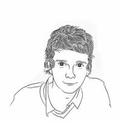

The Notepad theme for Grav is a direct port of the [Notepad Theme for Jekyll](http://hmfaysal.github.io/Notepad/) designed by [Hossain Mohd Faysal](http://hmfaysal.github.io/).

You can **download** the theme here: [github.com/getgrav/grav-theme-notepad](https://github.com/getgrav/grav-theme-notepad) but it's strongly advised to download the complete [Download Notepad Skeleton](http://getgrav.org/downloads/skeletons#extras).

You can find out more info about customizing your Grav theme, as well as basic Grav usage documentation at [learn.getgrav.org](http://learn.getgrav.org)

You can find the source code for Grav at [github.com/getgrav/grav](https://github.com/getgrav/grav)
